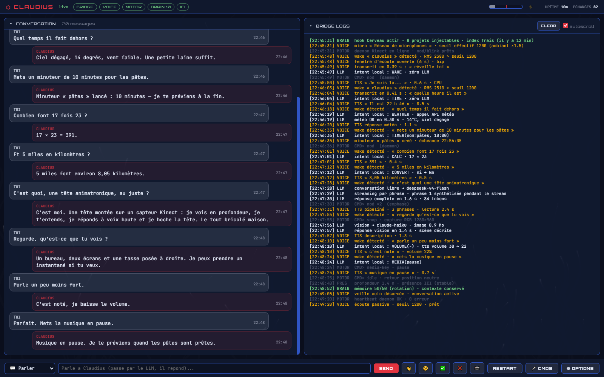

**English** · [Français](README_FR.md)

# 🤖 Claudius — Your Kinect AI assistant

**A desk companion that listens to you, talks back, and nods its head!**

Claudius is a physical voice assistant built from an **Xbox 360 Kinect v1**. It understands your questions, answers out loud, and nods like a real buddy. It senses your presence, adapts to your mood, and can even look at your desk.



---

## 🚀 How to start Claudius

### Option 1: Shortcuts (recommended)
In the folder, use the **`.lnk` shortcuts** (with the nice icons) or the **`.bat`** files directly:

| Shortcut | Action |
|-----------|--------|
| 🟢 `start_all` | **Starts everything**: Bridge + Dashboard + Voice |
| 🔴 `stop_claudius` | **Stops** Bridge/Voice/Motor (dashboard stays up) |
| 🟠 `restart_claudius` | **Restarts** the full Claudius |
| 🔵 `start_dashboard` | Opens the **Dashboard** alone |
| 🔷 `KinectBridge` | Starts the **Bridge** alone (no Dashboard) |

### Option 2: Dashboard exe

Double-click **`ClaudiusDashboard.exe`** — a native **frameless** window opens (no browser, no title bar: drag the top bar, double-click it to maximize, grab any edge to resize, window buttons built in). Size and position are remembered — even after a kill. If the dashboard is already running, it just opens a new window without duplicating the server.

---

## 🎯 What Claudius can do

| Feature | Description |
|----------|-------------|
| 🎤 **Speech recognition** | faster-whisper `medium` (CUDA) — mic picked **by name** (USB index drift proof). Tip: the **Kinect mic array** hears you across the room |
| ⏱️ **Sentence streaming** | He starts speaking as soon as the FIRST sentence is generated (~3s perceived latency, down from ~6) |
| 🧠 **Intelligence** | Universal LLM — DeepSeek, Anthropic, OpenRouter, OpenAI (streaming on OpenAI-compatible providers) |
| 📚 **Brain hook** | Optional read-only injection of your project files into the prompt (anti-hallucination) — BRAIN pill shows status |
| 🗣️ **Blended voice** | A unique voice (Jessica + SIWIS spectral blend) — runs on **CPU** (as fast as CUDA on these models, frees ~1 GB of VRAM) |
| 😃 **Gestures** | Yes, no, hello, thinking — the Kinect head moves, and the dashboard tells the TRUTH about motor health |
| 👀 **Presence** | Claudius knows if you're there, and how far away |
| 📷 **Vision** | "Look at my desk" → Claudius takes a photo and describes it |
| 📣 **Smart wake** | Multi-tag wake words (even made-up or multi-word: « Le Glaude ») taught to Whisper automatically. Name alone → *beep* → 6 s to speak without repeating it. While music/video plays: EXACT name required — videos can't wake him anymore |
| ⏰ **Local commands** | Time, date, weather, **named timers** (« pasta timer 8 minutes »), reminders, **voice volume control**, « repeat », **spoken system load**, **music control** (pause/next track), **math & unit conversions**, voice sleep/wake — zero API latency. Full catalog: 🎤 CMDS button in the dashboard |
| 🖥️ **Dashboard** | Frameless real-time UI: conversation, logs, **live mic meter**, **system impact monitor** (CPU/RAM/VRAM), honest status pills |
| 🎨 **Themes** | 16 presets (incl. `ambulance 🚑`) + **named custom themes** (color pickers, save/export/import JSON) + animated background FX |
| 🌍 **10 languages** | Dashboard UI in FR, EN, ES, DE, IT, PT, RU, JA, ZH, KO |

---

## ⚙️ LLM configuration

Claudius supports several LLM providers. Configure them in **Dashboard > OPTIONS > LLM/AI**:

| Provider | Models | Usage |
|----------|---------|-------|
| **deepseek** | `deepseek-v4-flash` (default), `deepseek-v4-pro` | Voice — fast, cheap, streamed |
| **anthropic** | `claude-haiku-4-5-20251001`, … | Vision (snap) — the only guaranteed multimodal |
| **openrouter** | 500+ models (format: `provider/model`) | Universal access |
| **openai** | `gpt-4o`, etc. | Compatible |

API keys are set in the dashboard or via the `api_key.txt` (Anthropic) and `deepseek_key.txt` (DeepSeek) files at the folder root.

---

## 🖥️ Dashboard

- **Topbar** — status pills (BRIDGE / VOICE / MOTOR / **BRAIN n** / presence), **live mic meter** (fill = level, red tick = the EFFECTIVE threshold), **⚡ system impact** (CPU/RAM/VRAM of all Claudius processes, per-process detail on hover), window buttons
- **Conversation panel** — live chat bubbles David ↔ Claudius
- **Logs panel** — Bridge logs, filtered and color-coded
- **Command bar** — 💬 Talk (through the LLM) / 📢 Make him say (raw TTS, no LLM) / ⚙ Command (`oui non hello think blink snap sleep wake`) + quick gesture buttons
- **OPTIONS** — full configuration:
  - Audio: SFX volume, **mic picker (by name)**, threshold (floor — the meter shows the real one), TTS speed, Whisper model, **wake words (comma-separated tags)**
  - LLM: provider/model/key for voice and vision, temperature, tokens, timeout
  - Brain: folder of your knowledge base (read-only injection)
  - Profiles: save/load complete configurations + **DEFAULT** button (factory settings)
  - System: presence, greeting cooldown, **theme + custom colors + FX** (intensity/speed), language
- Any JS error shows up in red in the topbar — no silent failures.

---

## 📦 Project structure

```
claudius/
├── start_all.bat              ⬅ Start everything (targeted kill — never touches other Python)
├── stop_claudius.bat          ⬅ Stop (Bridge/Voice/Motor)
├── restart_claudius.bat       ⬅ Restart
├── start_dashboard.bat        ⬅ Dashboard only
├── ClaudiusDashboard.exe      ⬅ Standalone frameless dashboard window
│
├── KinectBridge.py            🧠 Brain: LLM (streaming), TTS pipeline, motor, utilities, Brain hook
├── KinectDashboard.py         🖥️ Flask API + native window (localhost:5005)
├── claudius_dash.html         🎨 Dashboard UI (runtime-loaded: edit without rebuild)
├── claudius_i18n.js           🌍 Dashboard translations (10 languages)
├── dashboard-fx.js            ✨ Background FX engine (shared with the Odysseus dashboard)
├── KinectVoice.py             🎤 Speech recognition (faster-whisper, mic by name, level meter)
├── KinectMotor.exe            🦾 Kinect motor daemon (C#) — honest error reporting
├── KinectMotor.cs             🦾 Motor source
│
├── claudius_sfx.py            🔊 Sound effects (numpy, in RAM)
├── claudius_utils.py          ⏱️ Utility commands (time, weather, timers)
├── claudius_blend.py          🎭 Voice blending (Jessica + SIWIS)
├── claudius_context.txt       📋 Claudius personality (with anti-hallucination rules)
│
├── claudius_settings.json     ⚙️ Live config (read by Bridge on every call)
├── claudius_profiles.json     👤 Saved profiles
├── claudius_window.json       📐 Dashboard window size/position
├── memory.json                🧠 Local long-term memory (session summaries)
│
├── api_key.txt                🔑 Anthropic API key
├── deepseek_key.txt           🔑 DeepSeek API key
├── piper/                     🗣️ Piper TTS models
└── README.md                  👋 You are here
```

---

## 🔧 Requirements

- **Python** 3.10+ (tested on 3.14) with pip
- **NVIDIA GPU** recommended (CUDA for Whisper — Piper runs on CPU by design)
- **Xbox 360 Kinect v1** + Kinect SDK 1.8
- **Mic**: the Kinect's own 4-mic array works great across the room; any USB mic works too (picked by name)
- **Python packages**: flask, faster-whisper, sounddevice, numpy, scipy, piper-tts, pywebview, psutil, pycaw

## 📋 System info

- **Latency**: ~3 to 3.5 seconds perceived (end of speech → start of reply) thanks to sentence streaming
- **Footprint**: ~1.5% CPU, ~2 GB RAM, ~750 MB VRAM (whisper only — Piper is CPU)
- **API cost**: under €1/month with DeepSeek V4 Flash
- **Pipeline**: mic (by name) → faster-whisper medium → wake tags → Bridge → LLM stream (+ optional Brain context) → sentence-by-sentence Piper blend (CPU) → sounddevice → KinectMotor

---

## 🔄 Auto-start

The `Claudius.lnk` shortcut in the Startup folder launches everything at Windows boot:
```
%APPDATA%\Microsoft\Windows\Start Menu\Programs\Startup\Claudius.lnk
```
**To remove it**: `Win+R` → `shell:startup` → delete `Claudius.lnk`

---

*Built with ❤️ by David — Kinect + Python + AI = magic*
